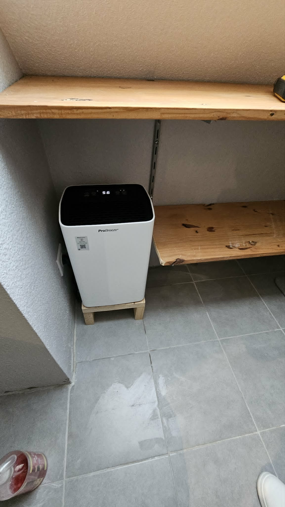
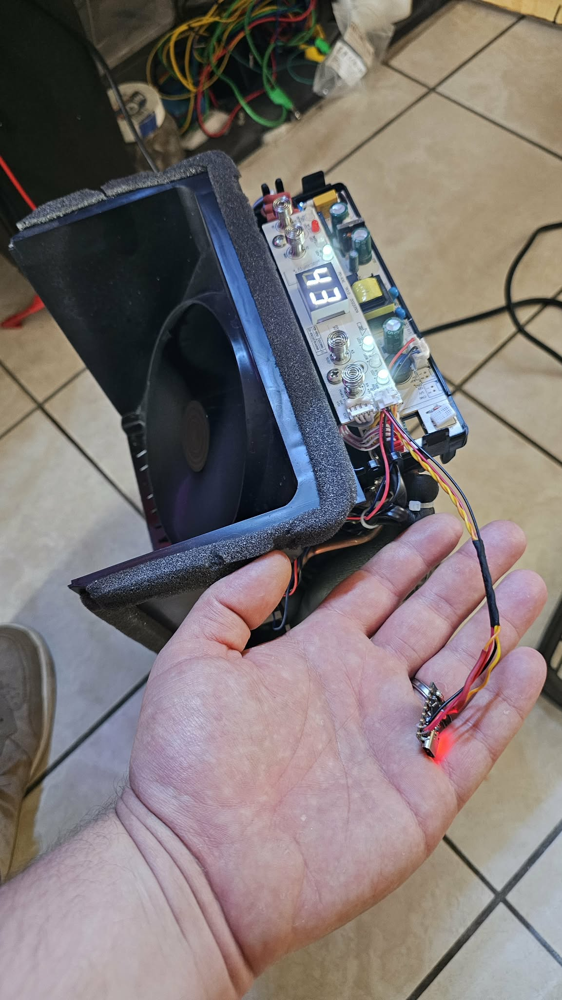
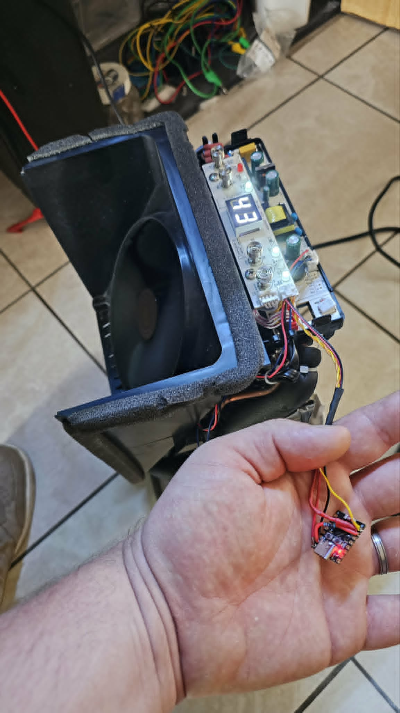
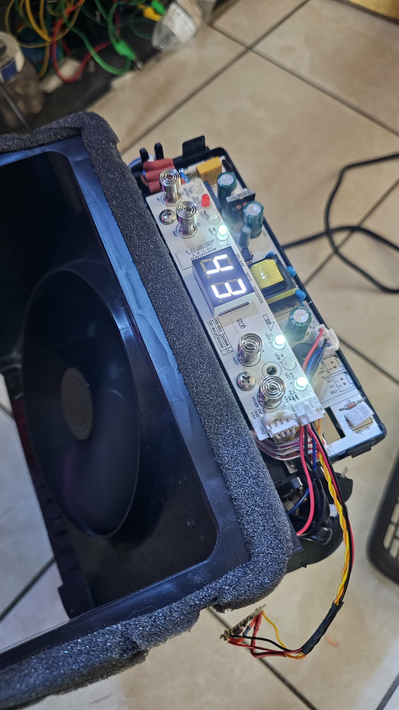
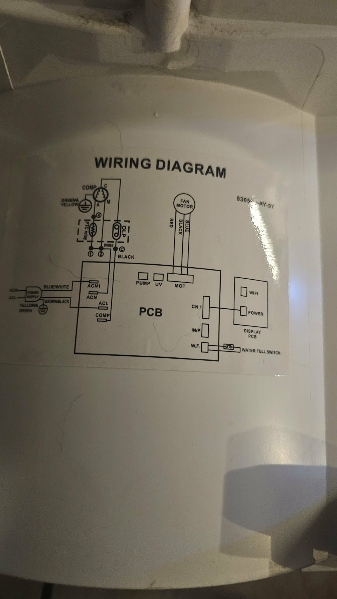
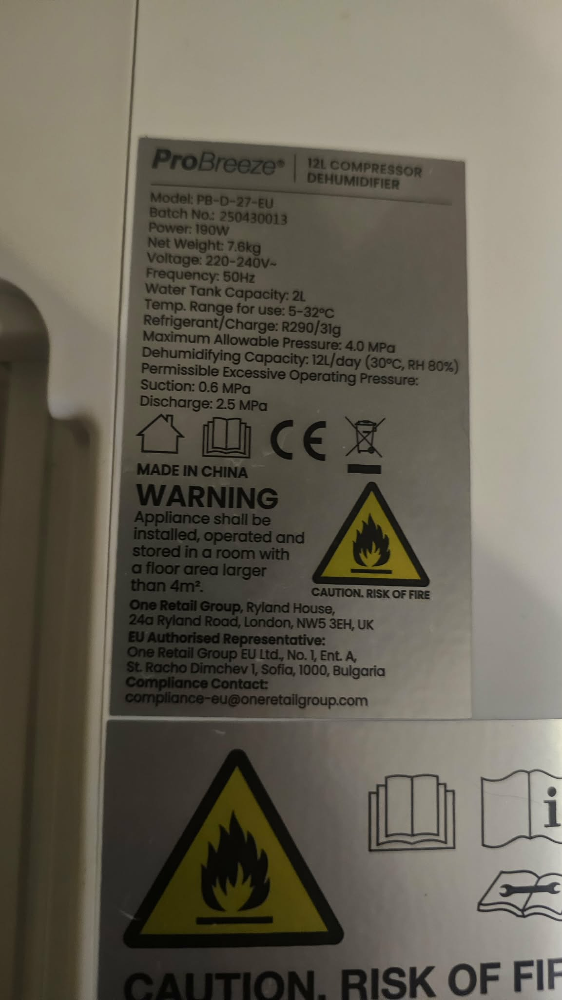

# ESPHome Tuya Dehumidifier Hack (Pro Breeze PB-D-27-EU)

Projet complet pour transformer un déshumidificateur Tuya en appareil **100% local** avec **ESPHome + Home Assistant**.

> ✅ Repo réorganisé “pro” : tutoriel pas-à-pas, câblage expliqué, configs séparées, galerie, dépannage.

## 📁 Structure du dépôt

```text
.
├── configs/
│   ├── esphome/
│   │   └── deshumidificateur.yaml
│   └── lovelace/
│       ├── lovelace-demo.yaml
│       └── raptor-dehumidifier-card.js
├── docs/
│   ├── assets/
│   │   └── images/
│   ├── guides/
│   │   ├── 01-introduction.md
│   │   ├── 02-hardware-and-safety.md
│   │   ├── 03-wiring-step-by-step.md
│   │   ├── 04-esphome-installation-and-flash.md
│   │   ├── 05-home-assistant-and-lovelace.md
│   │   └── 06-troubleshooting.md
│   └── ProBreeze_PB-D-27-EU_ESPHome_Hack.pdf
├── LICENSE
└── README.md
```

## 🚀 Démarrage rapide

1. Lis **l’intro** : `docs/guides/01-introduction.md`
2. Vérifie **sécurité + matériel** : `docs/guides/02-hardware-and-safety.md`
3. Suis le **câblage pas-à-pas** : `docs/guides/03-wiring-step-by-step.md`
4. Flash ESPHome : `docs/guides/04-esphome-installation-and-flash.md`
5. Configure Home Assistant : `docs/guides/05-home-assistant-and-lovelace.md`
6. En cas de problème : `docs/guides/06-troubleshooting.md`

## 🧠 Compatible avec d'autres déshumidificateurs ?

Oui, **potentiellement**.

Cette méthode peut fonctionner avec d’autres modèles qui utilisent un **MCU Tuya via UART** (mêmes principes de câblage et de décodage datapoints). En revanche :

- les **datapoints (DP)** changent souvent selon la marque/modèle ;
- les niveaux logiques UART (3.3V/5V) peuvent différer ;
- les fonctions disponibles (mode, fan, timer…) varient.

👉 Voir la section dédiée dans `docs/guides/01-introduction.md`.

## 📸 Galerie



| Vue | Image |
|---|---|
| Connexion ESP32 vers appareil |  |
| Connexion vers carte de contrôle |  |
| Gros plan carte |  |
| Schéma interne |  |
| Plaque signalétique |  |

## 🤝 Contribution

Les améliorations sont bienvenues : nouveaux modèles compatibles, mappings DP, captures d’écran Lovelace, conseils de sécurité supplémentaires.
